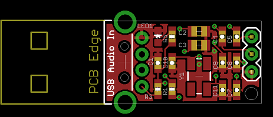
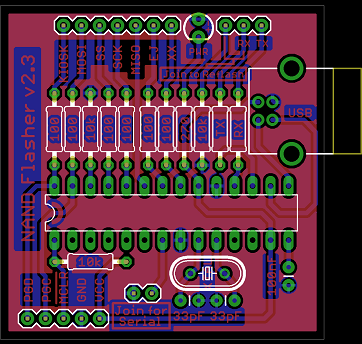

## PCB Portfolio

These are some PCBs I have laid out over the last couple years. 

Boards further down the list were designed with DIY-etching in mind (text in the copper layer, fewer vias, etc.). Newer boards were made through [OSHPark](http://www.oshpark.com/) and were designed to pass their DRC.

If you are interested in discussing one of my designs, or would like to hire me, please contact me [through email](mailto:parkinglotlust@gmail.com).

Cheers,
- Jordan

##TOC

[Raspberry Pi Measurement Shield](#raspberry-pi-measurement-shield)
[4 Channel Temperature Controller](#4-channel-temperature-controller)
[Wrist-Mounted Accelerometer](#wrist-mounted-accelerometer)
[Interval Timer](#interval-timer)
[Traffic Light Control Board](#traffic-light-control-board)
[USB Line In](#usb-line-in)
[USB Toggle Switch](#usb-toggle-switch)
[Aircraft Receiver](#aircraft-receiver)
[Lift Light](#lift-light)
[Breadboard Power Supply](#breadboard-power-supply)
[LiPo Power Supply](#lipo-power-supply)
[Beat Detector](#beat-detector)
[Xbox NAND Flasher](#xbox-nand-flasher)

## Projects

## Raspberry Pi Measurement Shield

Current clamps, passthrough current sense, pressure, temperature

### Top & Bottom of Board
 

 
## 4 Channel Temperature Controller

Measures 4 thermocouples and independantly drives 4 outputs

### Top & Bottom of Board
 

 
## Wrist-Mounted Accelerometer

With Bluetooth 4.0

### Top & Bottom of Board
 

 
## Interval Timer

I needed a timer to turn a pump on for 30 seconds, and off for 10 minutes. These values might change over time so the timer needed to be programmable. Two buttons, two bi-colour LEDs and a 4-digit 7-segment display allow enough flexibility for "UP", "DOWN", and "ENTER" buttons as well as a primitive menu system.

The board uses a non-isolated off-line regulator, which provides both 5v for the micro, and 12v for the output device (a micro relay, capable of 2A @ 120v). As it is non-isolated, care must be taken never to touch the board while it is live! Fortunately it will live inside a nice case, which the board has been designed for.

I am awaiting shipment on these boards.

#### v1.2 Processor, Display/IO & Power Supply Schematics
   

### v1.2 Top & Bottom of Board
 

 
## Traffic Light Control Board

This is just a simple board with three TRIACs & optos, meant to drive a traffic light (thanks Sean!) from an Olimex SAM9-L7260 board.

It has indicator lights on top to display the output status, as well as an enable line to prevent outputs being switched on until explicitly requested. Mounting holes allow it to be mounted; connectors allow it to be connected; the usual deal.

#### Schematic, Top & Bottom of Board
  

 
## USB Line In

Basically just a breakout board for a PCM29xx-series chip from TI, with just the microphone connected. It was designed to be as small as possible, and with a hole for cable strain relief. 

It will most likely be used to connect an audio device to a Raspberry Pi. If it works well enough I will make a few more to keep around the house. 

I am awaiting shipment on these boards.

#### Schematic, Top & Bottom of Board
  

 
## USB Toggle Switch

Four clunking toggle switches with indicator LEDs, connected via USB. The goal for this project is to add & remove `/etc/hosts` entries by turning switches on and off. This will allow for easily switching between local & remote development of a particular website simply by flipping a switch.

The board is designed with cutouts to fit into a specific rectangular enclosure, similar to a Wiimote. The hardware works - I'm currently working on firmware.

#### Schematic, Top & Bottom of Board
  

 
## Aircraft Receiver

This project is still a Work-In-Progress and the final design is un-tested.

The design of this circuit comes from [this site for an Aviation Band Receiver](http://www.sentex.ca/~mec1995/circ/aviarx/aviarx.html), with the board designed to fit perfectly inside [this Hammond enclosure](http://www.hammondmfg.com/pdf/1593L.pdf).

#### Schematic, Top & Bottom of Board
  

 
## Lift Light

This was a small board I created for a car I owned (A 7th-gen Toyota Celica). I wanted a light to turn on when the engine's "Lift" (VVTL-I) was activated. 

When "Lift" was activated, a 10% 200Hz square wave signal would go to 100% duty. To detect this condition, a simple 2.5Hz LPF is used to filter out the 200Hz signal. The output is fed to an op-amp, which drives a MOSFET (and eventually a load). 

The circuit board was designed to be small enough to fit in-line and be covered with heatshrink tubing.

#### Schematic, Top & Bottom of Board
  

 
## Breadboard Power Supply

This project turned out to be very helpful when working with op-amps. The board is sized to plug directly into a breadboard, and the inductors on the back keep the board at the correct height off the desk/table. 

Adjustment switches and knobs allow the output voltage to be preset, or adjusted.

#### Schematic & Board
 

 
## LiPo Power Supply

Unfortunately I've lost the schematic for this one... 

The board uses a MAX1555 to provide charging functionality for a LiPo battery. Power is provided via a mini-B USB port, or a DC barrel jack. 

A boost regulator is used to step the 3.7v output voltage up to 5v. An LDO was used to provide a clean 3.3v signal for an accelerometer and gyro.

#### Board

 
## Beat Detector
This board uses a low-pass filter, envelope detector and a comparator to flash lights to the beat of music. It also has a power MOSFET to drive a decent-sized load (I was driving about 50 LEDs).

If I made another version of this board, I would likely drop the monostable 555 as I'm not really a fan of it's effect. Or possibly add a bypass switch, or more adjustments. Would also rework it to be much smaller, and with more convenient mounting holes.

#### Schematic & Board
 

 
## Xbox NAND Flasher

This board went through several design iterations. It started out as a way to flash the SPI NAND chip on an Xbox360. Eventually a [group-buy](https://web.archive.org/web/20120404002711/http://forums.xbox-scene.com/index.php?showtopic=699595) for these devices was started, and I producing and assembled a panel of these boards. Lesson learned: pay someone else to fab boards! DIY boards should *not* be sold en-masse.

Two revisions are shown; the newer of the two shows the addition of an integrated USB-B connector, extra features (ability to output serial, built-in bootloader for reflashing), and bug-fixes (a crystal turned out to be much more stable than a resonator).

#### v2.0 Schematic & Board
 
- - -
#### v2.3 Schematic & Board 
 